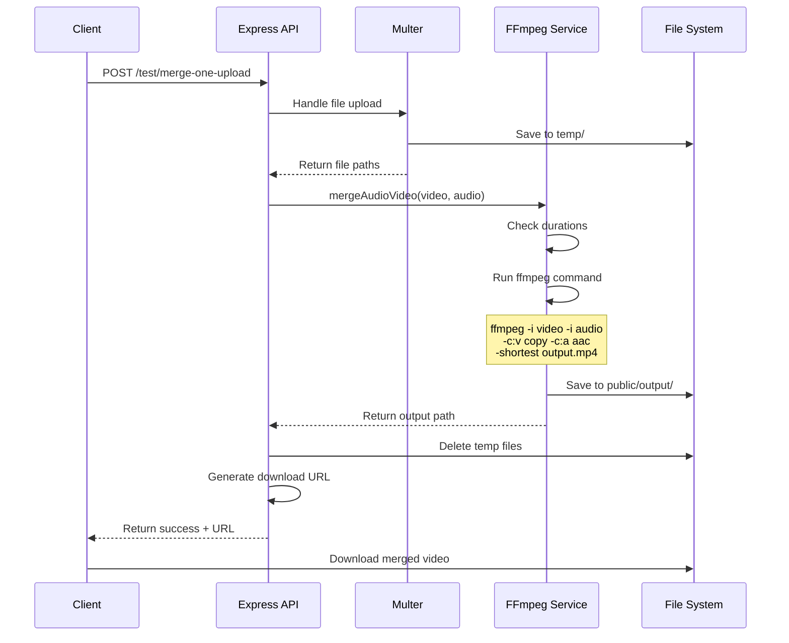
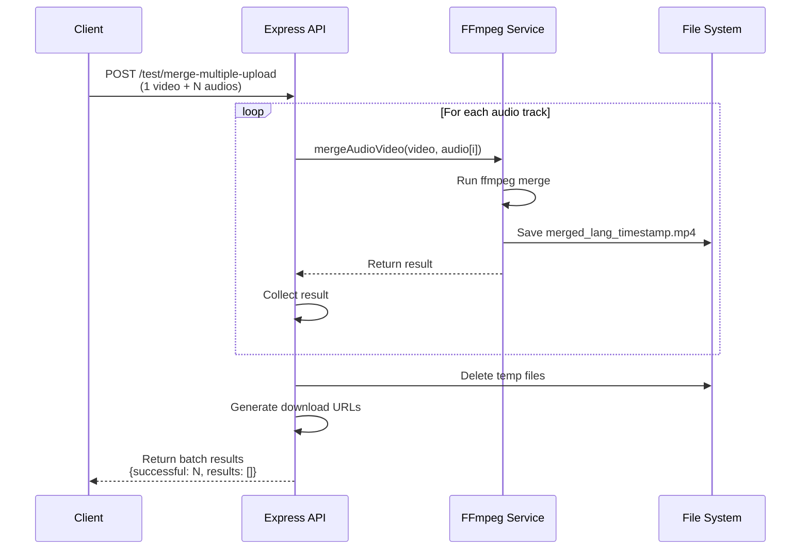
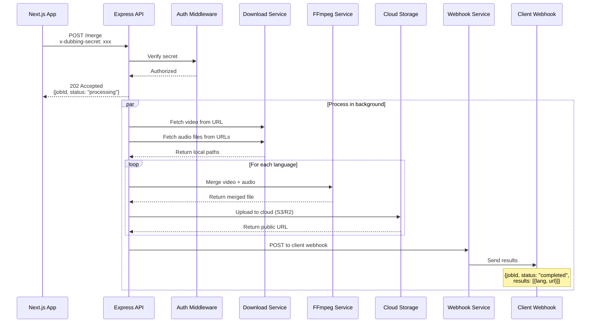
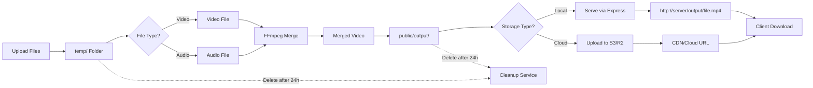
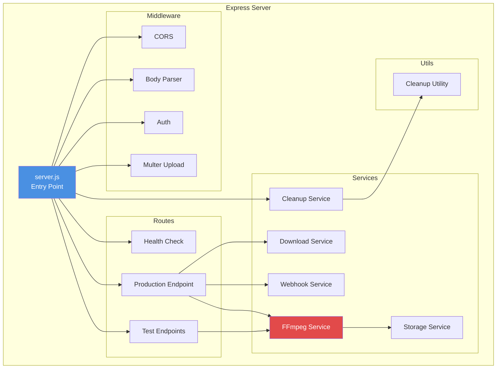
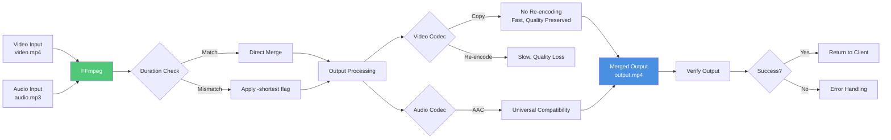
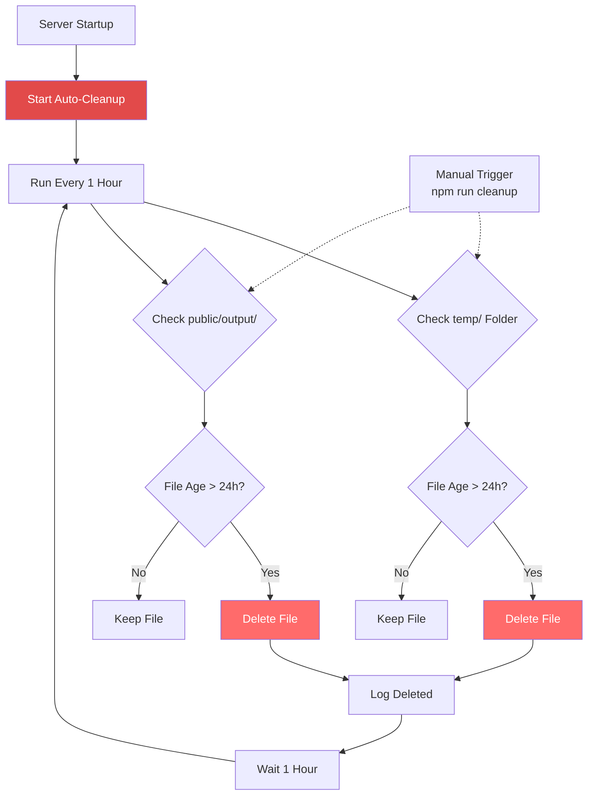
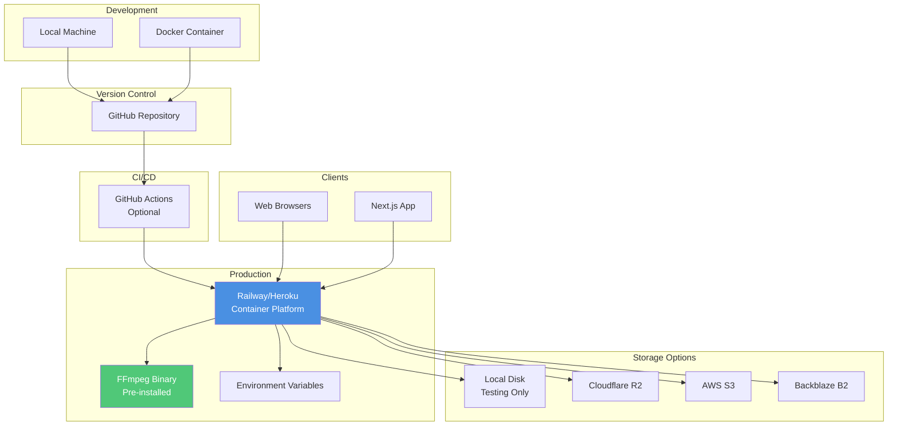
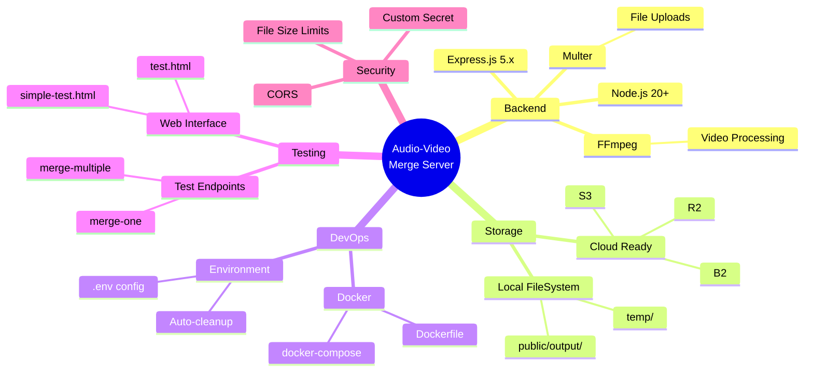

# Audio-Video Merge Server - Architecture Diagram

## System Architecture

```mermaid
graph TB
    subgraph "Client Applications"
        A[Web Browser]
        B[Next.js App]
        C[Mobile App]
    end

    subgraph "API Layer"
        D[Express Server<br/>Port 8080]
        E[Auth Middleware]
        F[File Upload<br/>Multer]
    end

    subgraph "Routes"
        G[/health]
        H[/test/merge-one]
        I[/test/merge-one-upload]
        J[/test/merge-multiple]
        K[/test/merge-multiple-upload]
        L[/merge<br/>Production]
    end

    subgraph "Services"
        M[FFmpeg Service<br/>Audio/Video Merge]
        N[Download Service<br/>Fetch Remote Files]
        O[Storage Service<br/>Local/Cloud Storage]
        P[Webhook Service<br/>Notify Completion]
        Q[Cleanup Service<br/>Delete Old Files]
    end

    subgraph "Storage"
        R[(temp/<br/>Temp Uploads)]
        S[(public/output/<br/>Merged Videos)]
        T[(storage/<br/>Future Cloud)]
    end

    subgraph "External"
        U[FFmpeg Binary]
        V[Cloud Storage<br/>S3/R2/etc]
        W[Webhook Receiver<br/>Client Server]
    end

    A --> D
    B --> D
    C --> D
    
    D --> E
    E --> F
    F --> G
    F --> H
    F --> I
    F --> J
    F --> K
    F --> L
    
    H --> M
    I --> M
    J --> M
    K --> M
    L --> M
    L --> N
    L --> P
    
    M --> U
    M --> S
    N --> R
    O --> S
    O --> V
    P --> W
    Q --> R
    Q --> S
    
    style D fill:#4A90E2,stroke:#2E5C8A,stroke-width:3px,color:#fff
    style M fill:#E24A4A,stroke:#8A2E2E,stroke-width:2px,color:#fff
    style U fill:#50C878,stroke:#2E8A4A,stroke-width:2px,color:#fff
```

## Request Flow Diagrams

### Single Audio/Video Merge Flow



### Multiple Audio Tracks Flow



### Production Merge Flow (Future)



## Data Flow

### File Processing Flow



## Component Architecture



## FFmpeg Processing Pipeline



## Cleanup System



## Deployment Architecture



## Technology Stack



---

## Notes

- **FFmpeg**: Core dependency for video/audio processing
- **Multer**: Handles multipart/form-data file uploads (up to 500MB per file)
- **Storage**: Currently local, designed for easy cloud migration
- **Cleanup**: Automatic deletion of files older than 24 hours
- **Scalability**: Supports batch processing of up to 50 audio tracks per request
