# Audio-Video Merge & Dubbing Server - Architecture & ERD Diagram

The `erd.md` file holds all the architectural and design diagrams for the project. Initially, the project did not have a database (hence the generic system diagrams), but it has since been updated to use **Firebase Firestore** for tracking async dubbing jobs.

Below is the Entity Relationship Diagram (ERD) of the Firestore database, followed by the system architecture diagrams.

## Database Schema / Entity Relationship Diagram (ERD)

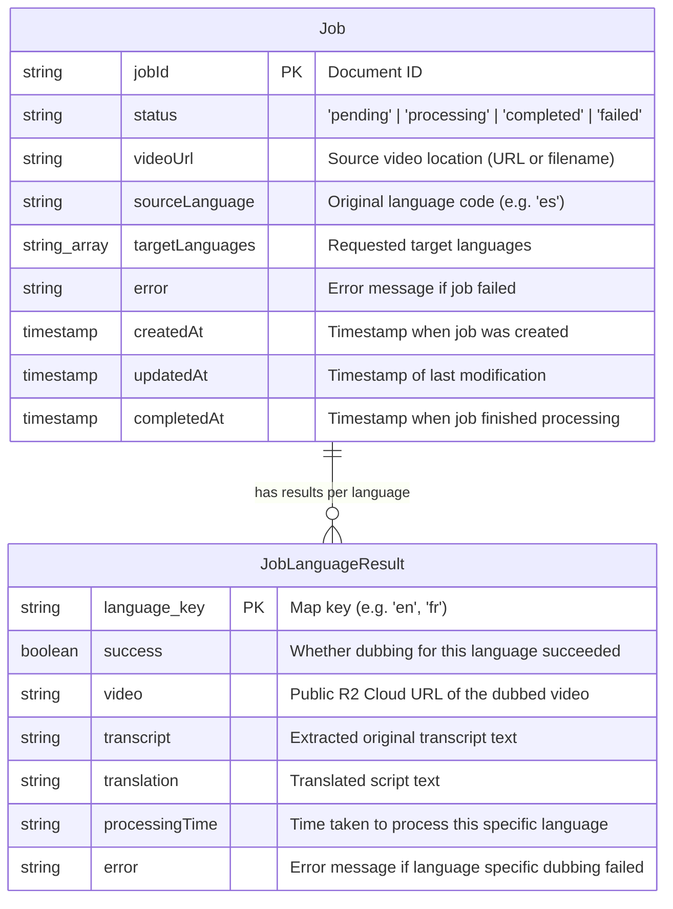

## System Architecture

```mermaid
graph TB
    subgraph "Client Applications"
        A[Web Browser / HTML Test Clients]
        B[Next.js Application]
        C[Mobile Application]
    end

    subgraph "API Layer"
        D[Express Server<br/>Port 8080]
        E[Multer File Upload]
    end

    subgraph "Routes"
        subgraph "Merge-Only Route Namespace"
            G["/health"]
            H["/test/merge-one"]
            I["/test/merge-one-upload"]
            J["/test/merge-multiple"]
            K["/test/merge-multiple-upload"]
            L["/merge<br/>Production"]
        end
        subgraph "Dubbing Pipeline Route Namespace"
            DA1["/api/dubbing/async/single"]
            DA2["/api/dubbing/async/upload"]
            DA3["/api/dubbing/async/status/:jobId"]
        end
    end

    subgraph "Services & Processors"
        DP[Dubbing Processor]
        
        subgraph "Merge-Only Services"
            M[FFmpeg Service<br/>Audio/Video Merge]
            N[Download Service]
            O[Storage Service]
            P[Webhook Service]
        end
        
        subgraph "Dubbing Pipeline Services"
            AES[Audio Extraction Service]
            TS[Transcription Service]
            TLS[Translation Service]
            TTSS[TTS Service]
        end

        subgraph "Shared Infrastructure Services"
            R2S[Cloudflare R2 Service]
            FBS[Firebase Firestore Service]
            CS[Cleanup Service]
        end
    end

    subgraph "Storage & Database"
        DB[(Firestore DB<br/>Job Statuses)]
        T_DIR[(temp/<br/>Local Temp Files)]
        O_DIR[(public/output/<br/>Local Output Files)]
    end

    subgraph "External Integration APIs"
        EXT_FFMPEG[FFmpeg Binary]
        EXT_AAI[AssemblyAI API<br/>Transcription]
        EXT_DEEPL[DeepL API<br/>Translation]
        EXT_REPLICATE[Replicate API<br/>Kokoro-82M TTS]
        EXT_R2[Cloudflare R2<br/>Cloud Storage]
        EXT_WEBHOOK[Webhook Receiver]
    end

    A --> D
    B --> D
    C --> D
    
    D --> E
    E --> G
    E --> H
    E --> I
    E --> J
    E --> K
    E --> L
    E --> DA1
    E --> DA2
    E --> DA3
    
    %% Merge-Only connections
    H --> M
    I --> M
    J --> M
    K --> M
    L --> M
    L --> N
    L --> P
    M --> EXT_FFMPEG
    M --> O_DIR
    N --> T_DIR
    O --> O_DIR
    P --> EXT_WEBHOOK
    
    %% Dubbing pipeline connections
    DA1 --> FBS
    DA2 --> FBS
    DA1 --> DP
    DA2 --> DP
    DA3 --> FBS
    
    DP --> AES
    DP --> TS
    DP --> TLS
    DP --> TTSS
    DP --> M
    DP --> R2S
    DP --> FBS
    
    AES --> EXT_FFMPEG
    TS --> EXT_AAI
    TLS --> EXT_DEEPL
    TTSS --> EXT_REPLICATE
    R2S --> EXT_R2
    FBS --> DB
    
    CS --> T_DIR
    CS --> O_DIR
    CS --> FBS
    
    style D fill:#4A90E2,stroke:#2E5C8A,stroke-width:3px,color:#fff
    style DP fill:#E24A4A,stroke:#8A2E2E,stroke-width:2px,color:#fff
    style EXT_FFMPEG fill:#50C878,stroke:#2E8A4A,stroke-width:2px,color:#fff
    style EXT_AAI fill:#8A2EE2,stroke:#5c1fa1,stroke-width:2px,color:#fff
    style EXT_DEEPL fill:#FF8C00,stroke:#d17300,stroke-width:2px,color:#fff
    style EXT_REPLICATE fill:#FF1493,stroke:#c40c6e,stroke-width:2px,color:#fff
    style DB fill:#FFCC00,stroke:#cca000,stroke-width:2px,color:#000
    style EXT_R2 fill:#FF7F50,stroke:#d15e34,stroke-width:2px,color:#fff
```

## Request Flow Diagrams

### Async Dubbing Pipeline Flow (Multi-Language)

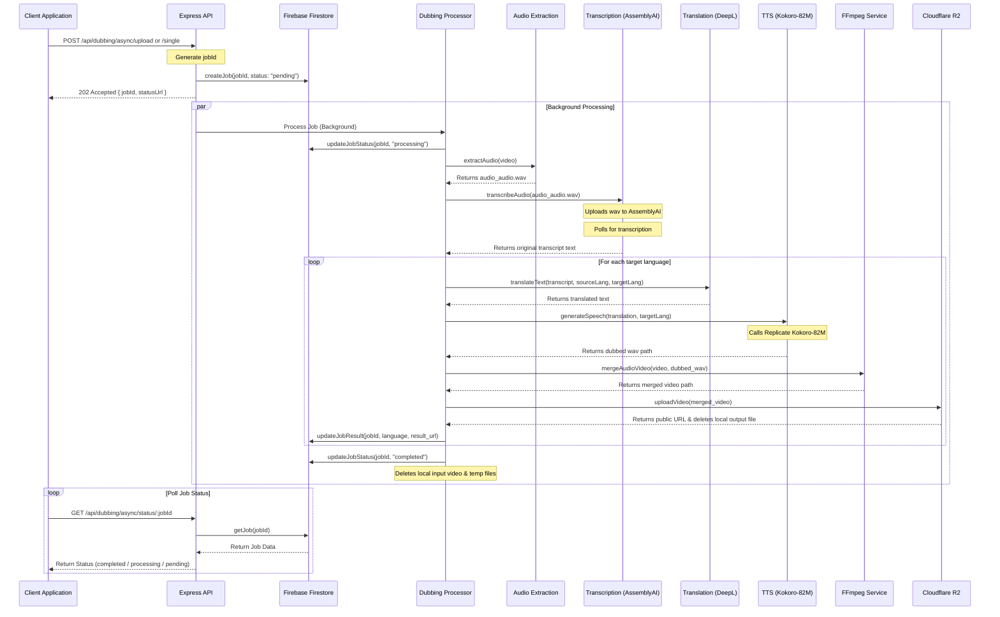

### Single Audio/Video Merge Flow

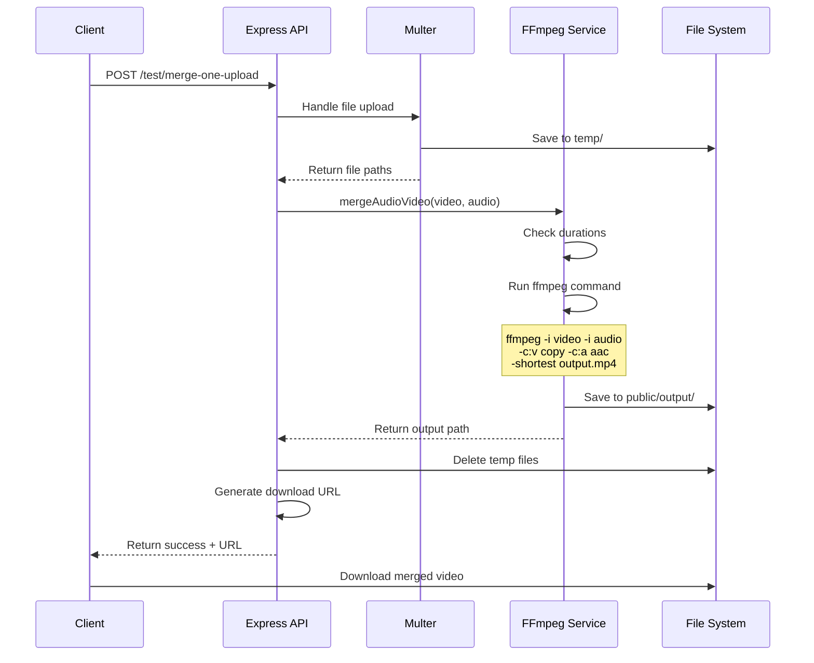

### Multiple Audio Tracks Flow

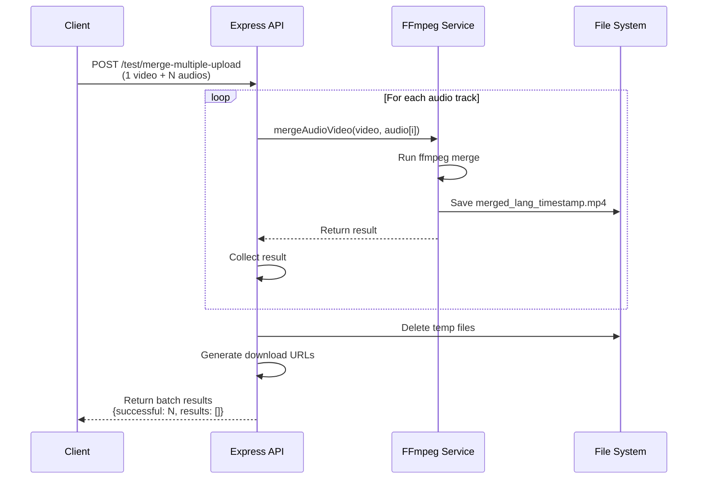

## Data Flow

### Dubbing and Processing Data Flow

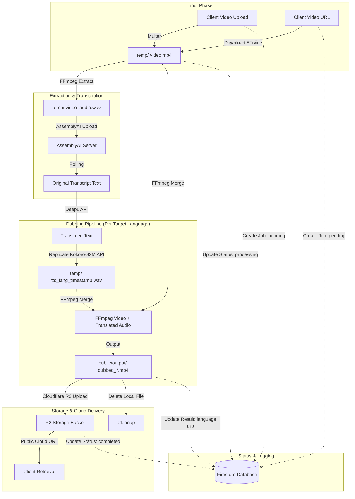

## Component Architecture

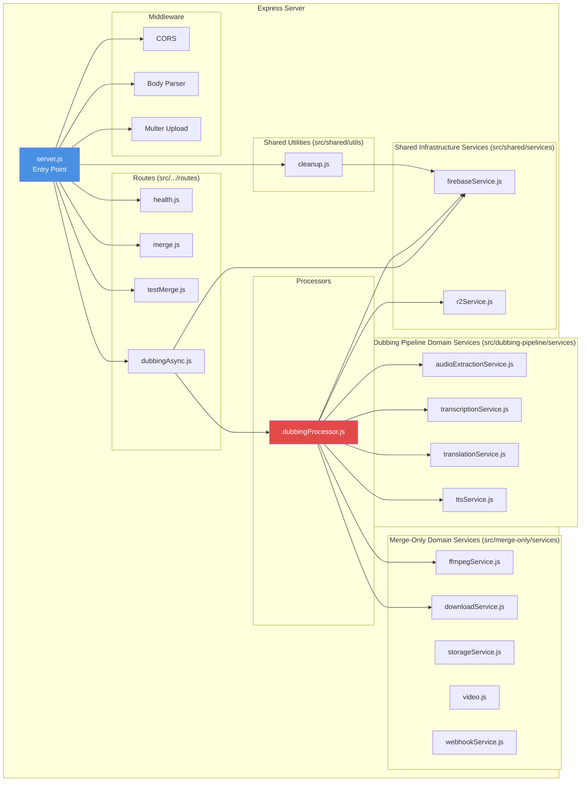

## FFmpeg Processing Pipeline

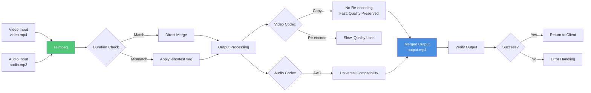

## Cleanup System

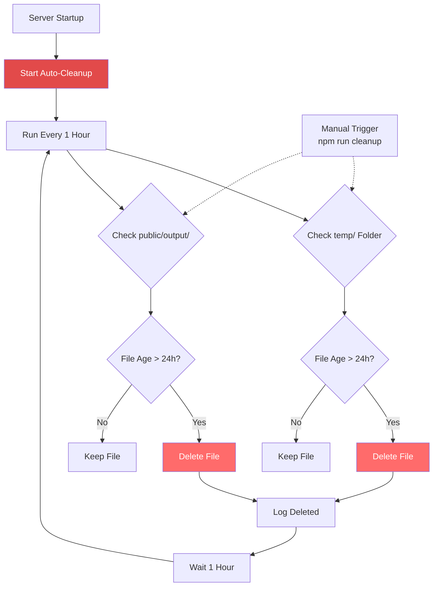

## Deployment Architecture

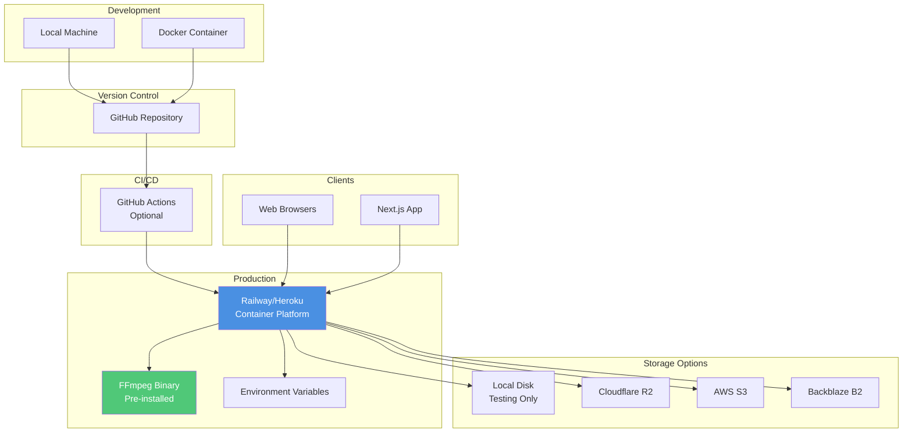

## Technology Stack

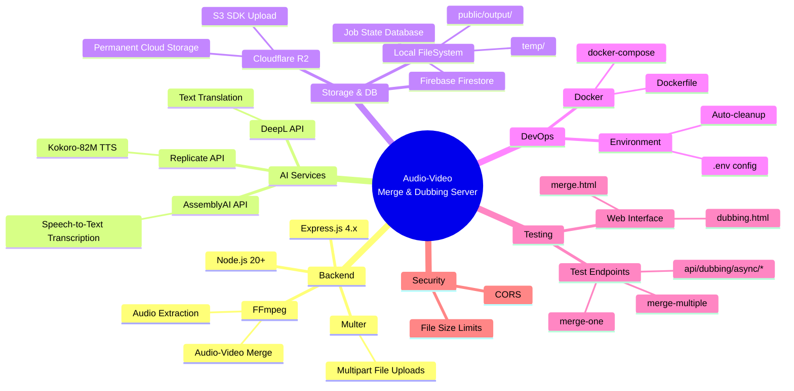

---

## Notes

- **FFmpeg**: Core dependency for video/audio extraction and merging
- **Multer**: Handles multipart/form-data file uploads (up to 500MB per file)
- **AssemblyAI**: Used for high-quality speech-to-text transcription
- **DeepL**: Used for translation across target languages
- **Replicate & Kokoro-82M**: Generates high-quality synthetic speech dubbed tracks
- **Firebase Firestore**: Stores job states (pending -> processing -> completed/failed) and results
- **Cloudflare R2**: Used for hosting final dubbed video files publicly
- **Storage**: Automatically cleaned up (local files deleted after upload to R2, local temp files older than 24 hours deleted, and Firestore jobs older than 48 hours deleted)
